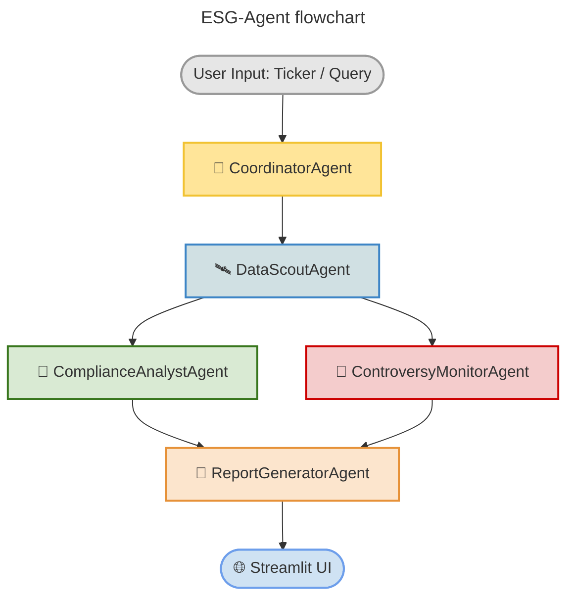

# ESG-Agent 🤖🌱  
**A multi-agent AI workforce for real-time ESG compliance reporting**  
*@MachineTalents X UM Hackathon @ Google project proposal from Clifton Coders*
> Let’s make ESG smarter, faster, and more accessible—together. 🌍

## 🌍 1 Why ESG-Agent?  
Every listed company must now disclose Environmental, Social and Governance (ESG) metrics—but the data is fragmented across APIs, PDFs, and breaking news. Manual workflows burn analyst hours and still miss fast-moving controversies.

**ESG-Agent** replaces that grind with an autonomous “AI workforce” that gathers data, scores risk, and produces an executive-ready report in **seconds, not days**, tailored for startups, small-scale companies, and individuals.

## ⚙️ 2 Key Features & Agents

| 🧩 Feature                        | 💡 What it does                                                                     | 🧠 Agent                   |
|----------------------------------|--------------------------------------------------------------------------------------|---------------------------|
| 🔍 Real-time Data Scouting       | Queries ESG APIs and news sources for the latest metrics and headlines              | `DataScoutAgent`          |
| 📊 Rules-based Compliance Check | Converts raw data into ESG pillar scores and detects strengths & risks              | `ComplianceAnalystAgent`  |
| 🧾 Auto-Formatted Reporting      | Produces an investor-friendly summary with Plotly charts                            | `ReportGeneratorAgent`    |
| 🚨 Controversy Detection         | Monitors headlines, news and social media for emerging controversies                | `ControversyMonitorAgent` |
| 🔧 Pluggable Workforce           | Add/swap agents easily with CAMEL/OWL agent framework                               | All agents                |

> 💬 More agents can be added modularly to scale scope and complexity.

## 🧠 3 System Architecture

* **CoordinatorAgent** routes tasks to specialists.
* **DataScoutAgent** retrieves ESG scores and facts.
* **ComplianceAnalystAgent** scores ESG performance using rule-based logic.
* **ControversyMonitorAgent** identifies recent controversies from news/social sources.
* **ReportGeneratorAgent** assembles final report (charts + narrative).
* **Streamlit UI** delivers insights through a simple dashboard.

## 🛠️ 4 Tech Stack

| Layer               | Technology                                        | Purpose                    |
| ------------------- | ------------------------------------------------- | -------------------------- |
| **Language**        | Python 3.9+                                       | Rapid prototyping          |
| **Agent Framework** | [CAMEL-AI / OWL](https://github.com/camel-ai/owl) | Modular multi-agent setup  |
| **LLM Backend**     | OpenAI GPT-4o                                     | Natural language reasoning |
| **Data Sources**    | ESG Enterprise API, Alpha Vantage, yfinance       | ESG + financial data       |
| **UI Layer**        | Streamlit                                         | Lightweight frontend       |
| **Visualization**   | Plotly                                            | ESG scorecards and gauges  |

## 📬 5 Contact
For any questions, contact ...

- [Akin Ibitoye](https://github.com/AKforCodes)
- [Mohammed Ali](https://github.com/M-Ali2404)
- [Tom Lam](https://github.com/T0mLam)

